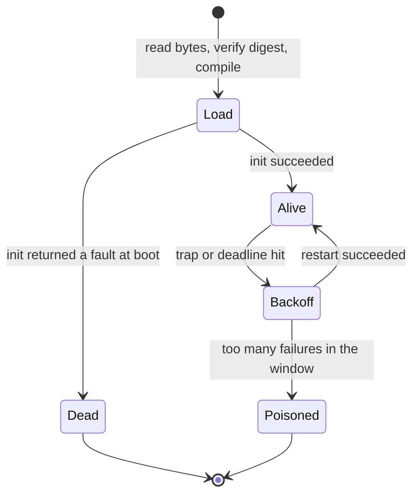
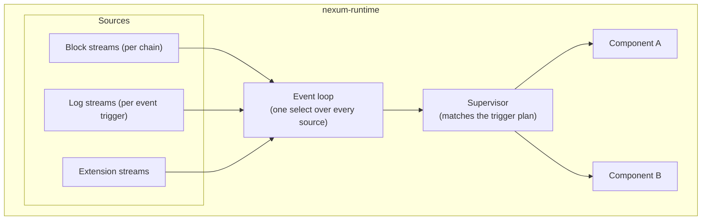

# Component lifecycle, trigger system, and packaging

## The component bundle

A component is distributed as a bundle: a WASM component plus a manifest that declares its identity, its triggers, and the capabilities it depends on.
The manifest is the bridge between packaging, the trigger system, and the runtime lifecycle.
See [ADR-0016](adr/0016-component-vocabulary.md) and [ADR-0020](adr/0020-retire-component-kind.md).

### Manifest (`component.toml`)

Every component ships with a manifest.
The file is named `component.toml`.
The operator config is a separate, trusted file: see [ADR-0001](adr/0001-operator-config-separate-and-trusted.md).

```toml
[component]
name    = "twap-monitor"
version = "0.3.0"

# Optional content pin: the line `nexum digest <artifact>` prints.
digest = "sha256:9f86d081884c7d659a2feaa0c55ad015a3bf4f1b2b0b822cd15d6c15b0f00a08"

# Per-component resource requests. Each field narrows the engine [policy]
# ceiling and never widens it.
[component.resources]
max_fuel_per_dispatch = 500_000_000

# What this component depends on. The engine cross-checks the component's
# WIT imports against this table before instantiation, and an import
# outside the declared set refuses the boot.
[dependencies]
chain       = {}
local-store = {}
logging     = {}
http        = { hosts = ["api.cow.fi"] }

# Triggers: what the runtime feeds this component.
[[trigger]]
on = "block"
chain_id = 42161

[[trigger]]
on = "event"
chain_id = 42161
address = "0xfdaFc9d1902f4e0b84f65F49f244b32b31013b74"
event_signature = "0x0000000000000000000000000000000000000000000000000000000000000000"
resume = true

[[trigger]]
on = "schedule"
cron = "*/5 * * * *"

# Opaque config, handed to the guest as string pairs.
[config]
api_url = "https://api.cow.fi/arbitrum"
min_twap_interval_secs = 120
enable_alerts = true
```

Key design points:

- **`digest` is a verification pin, not a locator.**
  The engine hashes the bytes it read and compares them to the pin before it compiles them (`crates/nexum-runtime/src/supervisor/artifact.rs`).
  The pin is optional: an absent pin loads with a warning, unless `require_component_digest = true` under `[engine]` in `engine.toml` makes it a boot error.
  The operator can pin the same artifact independently with `digest` on its `[[modules]]` entry in `engine.toml`, and the warning is silent when that pin covers the artifact, because the bytes are verified either way.
  A refusal names which of the two pins the bytes disagree with, so the operator knows which file to edit.
- **`[[trigger]]` tables are declarative.**
  A component does not open its own sources imperatively.
  The runtime loads each component and runs its `init` first, then derives the plan from the booted supervisor and opens the sources.
  `call_init` runs during load in `crates/nexum-runtime/src/supervisor/load.rs`, and `source_plan` reads the already-booted supervisor in `crates/nexum-runtime/src/supervisor/sources.rs`.
- **`[dependencies]` drives what the runtime links.**
  Each key names a host capability, and its table carries the attributes that qualify it.
  A component that declares `http` imports `wasi:http/outgoing-handler`, the SDK's `http::fetch` helper wraps it, and the host checks every outgoing request against the `hosts` list on the `http` dependency.
  See `modules/examples/http-probe` for a complete example.
- **The `[dependencies]` table is mandatory.**
  A manifest with no table at all is refused; an empty table is valid and grants nothing.
  `hosts` qualifies the `http` dependency and nothing else, and it is refused anywhere else rather than silently dropped.
- **Chain ids are declared per trigger**, not in a top-level `[chains]` table.
  Each `[[trigger]]` names its own `chain_id`.
  If `engine.toml` carries no `[chains.<id>]` entry for a chain a trigger names, the engine refuses the boot in the prepass, before any component is compiled.
- **`[config]` is opaque to the runtime.**
  The guest receives `list<tuple<string, string>>`.
  The host flattens each TOML scalar to its text form on the way through, and renders an array or a table as its TOML representation.
  A typed `config-value` variant is a later change.

The declarable core capability names are `chain`, `local-store`, `logging`, and `http`, plus the gated WASI names `wasi-sockets` and `wasi-filesystem`.
`wasi:io`, `wasi:clocks`, `wasi:random`, and `wasi:cli` are ambient and are never declared.
Any other `wasi:` import is refused fail-closed.
An extension registers further names under its own namespace: see [the linker extension seam](design/linker-extension-seam.md).

> Resource ceilings are set in `engine.toml` `[policy]`: `max_fuel_per_dispatch` (default 1e9), `max_memory_bytes` (default 64 MiB), and `max_state_bytes` (default 50 MiB).
> The dispatch deadline is `[limits.dispatch].deadline_secs` (default 120).
> `[policy]` also bounds module logging with `max_log_record_bytes` (default 8 KiB), `max_log_burst`, and `max_log_records_per_sec`: a record over the cap is truncated and a module over the rate loses records.
> The `nexum:host/logging` verbs and captured `stdout`/`stderr` lines share one bucket per run, so a `println!` loop is bounded exactly as a `log` loop is.
> `log_print_level`, `log_retain_level` and a `[policy.log_targets]` table filter the same path by level and target: the first gates the host console, the second gates what `nexum logs` keeps, and an unset `log_print_level` derives from `log_retain_level`.
> A `[policy.component.<id>]` row overrides them for one component, keyed on the `[[modules]].id` the operator writes.
> They resolve in `crates/nexum-runtime/src/engine_config/`.
> A `[component.resources]` field narrows one of them.
> It never replaces or widens one: the manifest is author-supplied, so the engine value is a ceiling and a request above it is clamped and logged (`crates/nexum-runtime/src/supervisor/store.rs`, `resolve_module_limits` and `clamp`).

### Bundle format

A bundle is a directory with a fixed layout:

```
twap-monitor/
|-- component.toml         # manifest
`-- component.wasm         # compiled component
```

The engine reads the artifact from the local filesystem path in the `[[modules]]` entry.
The manifest defaults to a `component.toml` beside the artifact, and the `manifest` key names one elsewhere.
An operator-owned manifest from outside the artifact directory, combined with `require_component_digest = true`, is what closes the gap against a compromised artifact store: the default sibling manifest sits in the same trust domain as the artifact it pins.

### Distribution

Distribution is out of scope for the runtime today.
The engine resolves no content address and fetches nothing: `[[modules]] path` is a local filesystem path, and `digest` verifies the bytes it reads there.

A content-addressed layer above the engine (a local content store fronting Swarm, IPFS, OCI, or plain HTTPS, keyed on the same sha256 the manifest already pins) fits without a manifest change, because the pin is already the trust anchor rather than the transport.
None of it is implemented here.

## Component lifecycle

Load is a straight-line function, not a state machine.
The persistent state is `Health` in `crates/nexum-runtime/src/supervisor/lifecycle.rs`: a lifecycle value plus a failure count and a sliding failure window.



| Value | Meaning |
|---|---|
| **Alive** | Dispatchable. The only value that receives triggers. |
| **Backoff** | A trap or a deadline hit ended the run. The supervisor revives it when the backoff expires. |
| **Dead** | The boot-time `init` returned a fault. Permanent: the supervisor never restarts it. |
| **Poisoned** | Too many failures inside the poison window. Terminal for the process; only an operator restart clears it. |

Load itself is ordered: the prepass resolves every manifest, claims namespaces, and gates triggered chains against `[chains]`; then modules load.

The backoff schedule doubles from 1 s and caps at 300 s, jittered into the upper half of each step so modules that failed together do not retry together.
The poison policy is 5 failures inside 600 s by default, configurable under `[limits.poison]`.
A failed restart defers the next attempt and does not itself count toward the poison window.
A successful dispatch resets the module's failure count.

### Key lifecycle properties

- **State survives a restart.**
  The redb local store is external to the WASM instance, and each component sees its own isolated namespace of it.
  A restarted component picks up where it left off.
- **Memory does not survive a restart.**
  Each restart builds a fresh `Store`: clean linear memory, no stale pointers.
- **The compiled `Component` is cached.**
  Reading, digest verification, and compilation happen once at load.
  A restart re-instantiates the cached component on a fresh store and runs `init` again; it never re-reads the file.
- **Config is immutable for a loaded component.**
  Changing config requires an engine restart.
- **There is no hot reload.**
  The engine watches no path and detects no artifact change.
  Adding, changing, or removing a component means editing `engine.toml` and restarting the engine.
- **Poison recovery is operator work.**
  The failure ring is in memory and clears at process start.

## Trigger system

### Architecture



### Triggers and their sources

| Trigger | Fires on | Source |
|---|---|---|
| `block` | A new block on a chain | `eth_subscribe("newHeads")` over an alloy provider, or polling on an HTTP URL |
| `event` | A log matching the filters | An `eth_getLogs` block-range poller, alloy's `watch_canonical_logs_from`, reorg-aware and backfilling from the start block on open |
| `schedule` | Not dispatched | Parsed and inert. The supervisor warns at load. |
| extension kinds | Whatever the extension delivers | `Extension::open_sources` |

Block streams are shared per chain.
If two components declare block triggers on chain 42161, the runtime opens one block stream and fans it out to both.
A log stream is opened per event trigger and tagged with the owning component.

Only a dispatchable component contributes to the plan, so no stream opens for a dead or poisoned one.

### Dispatch

There is no router struct and no per-component inbox.
One `run` loop owns the supervisor, selects one trigger from the merged sources, and dispatches it before it selects again (`crates/nexum-runtime/src/runtime/event_loop.rs`).
For one trigger, the supervisor walks the matching components serially and awaits each in turn (`crates/nexum-runtime/src/supervisor/dispatch.rs`).

- **Serial, not concurrent.**
  A slow component delays the whole engine.
  The wall-clock dispatch deadline is what bounds that delay.
- **Ordered within a source.**
  A component sees block N before block N+1.
  Interleaving between two different sources is not deterministic.
- **Rate limited per component.**
  Each component holds a token bucket, checked before the guest is entered: `burst` 256 and `refill_per_sec` 128 by default, configurable under `[limits.dispatch]`.
  A trigger over the rate is dropped, counted in `nexum_runtime_dispatch_dropped_total`, and never retried.
  The bucket carries across a restart.
- **No acknowledgement.**
  A successful return from `on-trigger` is not an ack.
  A component that needs progress tracking writes it to the local store itself.
- **Cursors commit only after a successful dispatch.**
  A `resume` event trigger persists its cursor after each successful dispatch, so a dropped or failed dispatch is re-delivered on the next boot rather than skipped.
- **Catch-up is the component's job, except for log backfill.**
  The engine backfills the gap for a `resume` trigger on reconnect, capped by `max_lookback`.
  Anything else, for example a gap across a restart on a non-resume trigger, is for the component to detect in `init` and to backfill through `chain::request`.

### What bounds one dispatch

Two mechanisms, and no others:

1. **Fuel.**
   `consume_fuel` is on in `wasmtime_config` (`crates/nexum-runtime/src/builder.rs`), and `dispatch` refuels the store to the resolved budget before every dispatch (`crates/nexum-runtime/src/supervisor/dispatch.rs`).
2. **A wall-clock deadline.**
   The dispatch runs under `[limits.dispatch].deadline_secs`, which covers the host-call time fuel cannot meter.
   A deadline hit leaves the store unusable, so it is treated like a trap: the run ends and the component restarts.

The host does not use epoch interruption.
`wasmtime_config` sets `wasm_component_model` and `consume_fuel` and nothing else (`crates/nexum-runtime/src/builder.rs:148-149`).

### Trigger encoding

Triggers cross the WASM boundary as the `trigger` variant in `wit/nexum-host/types.wit`:

```wit
variant trigger {
    block(block),
    event(log),
    schedule(schedule-tick),
    extension(extension-trigger),
}

record block {
    chain-id: chain-id,
    number: u64,
    hash: list<u8>,
    timestamp: u64,
}

record schedule-tick {
    fired-at: u64,
}

record extension-trigger {
    extension-kind: string,
    payload: list<u8>,
}
```

The canonical ABI carries the data, handled by `bindgen!`.
Every `u64` timestamp in the package is milliseconds since the Unix epoch, UTC.
`extension` is the generic extension trigger: the core routes it by `extension-kind` and never reads `payload`, and the declaring component decodes it against the extension that emitted it.

## The `nexum:host` world

The universal package is `nexum:host@0.1.0`, and it is a leaf: it imports no other package.
`wit/nexum-host/trigger-module.wit` declares the world a module is built against.

```wit
world trigger-module {
    use types.{config, trigger, fault};

    import chain;
    import local-store;
    import logging;

    export init: func(config: config) -> result<_, fault>;
    export on-trigger: func(trigger: trigger) -> result<_, fault>;
}
```

Time, randomness, and outbound HTTP are WASI concerns rather than `nexum:host` interfaces.
`wasi:clocks` and `wasi:random` are linked into every store, and the host links `wasi:http/outgoing-handler` gated by the `hosts` list on the `http` dependency.

A component built through `#[nexum_sdk::module]` does not import the whole world.
`nexum-world` synthesizes a per-component world whose imports are exactly the interfaces its `[dependencies]` declare, so an undeclared capability is absent by construction rather than trapped at first use.

## Putting it together

An operator deploys a module:

```
1. The operator adds an entry to engine.toml:

   [[modules]]
   id   = "twap-monitor"
   path = "/var/nexum/twap-monitor/twap_monitor.wasm"

2. The prepass resolves the sibling component.toml, claims the name as a
   local-store namespace, and checks that every triggered chain has a
   [chains.<id>] entry.

3. The supervisor reads the artifact, verifies sha256 against
   [component].digest, and compiles the Component.

4. It cross-checks the component's WIT imports against [dependencies] and
   refuses an import the manifest does not declare.

5. It builds a fresh Store under the resolved limits, instantiates, and
   calls init(config).

6. Once every component has loaded, the runtime derives the plan and
   opens the sources:
   - one block stream per triggered chain
   - one log stream per event trigger, seeded from its
     durable cursor when resume = true

7. Triggers flow:
   block 19_000_001 on Arbitrum
   -> event loop -> supervisor matches the plan
   -> await on-trigger(trigger::block(...)) on each matching component
   -> the component calls chain::request and local-store::set
   -> Ok(()) commits the block marker and the loop selects again

8. On a trap:
   -> the run ends, the failure is counted and the component enters Backoff
   -> the supervisor revives it after the backoff: fresh Store, init again
   -> local-store data is intact, so the component resumes
   -> five failures inside the window instead leave it Poisoned
```
